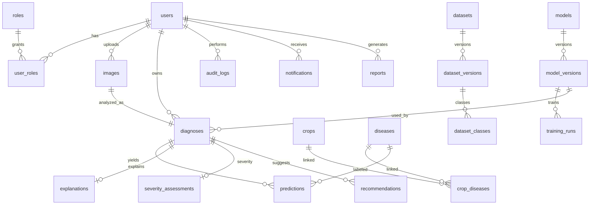

# PlantGuard AI — Database Architecture

## Overview

PostgreSQL is the system of record. Large binaries live in object storage; only metadata and keys are stored in relational tables. Redis holds cache, rate-limit counters, and Celery broker/result backends.

## ER overview (core)



## Core tables

### Identity

| Table | Key columns |
|-------|-------------|
| `users` | id, email, password_hash, full_name, role, is_verified, is_active, timestamps, last_login_at |
| `roles` | id, name, description |
| `user_roles` | user_id, role_id |

Roles: `USER`, `RESEARCHER`, `AGRICULTURAL_EXPERT`, `ADMIN`

### Domain knowledge

| Table | Key columns |
|-------|-------------|
| `plant_species` | common_name, scientific_name, family, description |
| `crops` | name, scientific_name, description |
| `diseases` | name, slug, description, pathogen_type, pathogen_name, symptoms, cause, prevention, management_notes, source_metadata JSONB |
| `crop_diseases` | crop_id, disease_id |

`source_metadata` is mandatory for knowledge content used in recommendations.

### Diagnosis pipeline

| Table | Key columns |
|-------|-------------|
| `images` | user_id, object_storage_key, filename, mime_type, file_size, width, height, checksum, quality_score |
| `diagnoses` | user_id, image_id, crop_id, plant_species_id, status, primary_prediction_id, overall_confidence, inference_time_ms, model_version_id |
| `predictions` | diagnosis_id, disease_id, label, probability, rank |
| `explanations` | diagnosis_id, method, heatmap_storage_key, mask_storage_key |
| `severity_assessments` | diagnosis_id, severity_score, severity_label, method |
| `recommendations` | diagnosis_id, title, description, priority, source_metadata |

### Research / MLOps

| Table | Key columns |
|-------|-------------|
| `datasets` | name, description, source, license, created_by |
| `dataset_versions` | dataset_id, version, image_count, class_count, checksum, metadata |
| `dataset_classes` | dataset_version_id, label, image_count |
| `models` | name, architecture, framework, description |
| `model_versions` | model_id, version, dataset_version_id, artifact_uri, metrics, status |
| `training_runs` | model_version_id, hyperparameters, metrics, started_at, completed_at, status |

Model lifecycle status: `development` → `validation` → `candidate` → `approved` → `production` → `retired`

### Governance & outputs

| Table | Key columns |
|-------|-------------|
| `audit_logs` | user_id, action, resource_type, resource_id, metadata, ip_address |
| `notifications` | user_id, title, message, type, read_at |
| `reports` | user_id, diagnosis_id, storage_key, report_type |

## Object storage keys (not in Postgres blobs)

```
plantguard/
  original/{user_id}/
  processed/{diagnosis_id}/
  heatmaps/{diagnosis_id}/
  masks/{diagnosis_id}/
  reports/{user_id}/
  datasets/
  models/
```

## Indexing guidance (Phase 2+)

- Unique: `users.email`, `diseases.slug`, role names
- FTS: diseases/crops name + description (PostgreSQL full-text; OpenSearch-ready later)
- Query: `diagnoses(user_id, created_at)`, `predictions(diagnosis_id, rank)`, `audit_logs(created_at)`
- Checksums on images/dataset_versions for integrity and dedupe

## Migration strategy

Alembic owns all schema changes. No ad-hoc production DDL. Seed scripts for roles and baseline disease/crop catalog are versioned separately from schema migrations.
